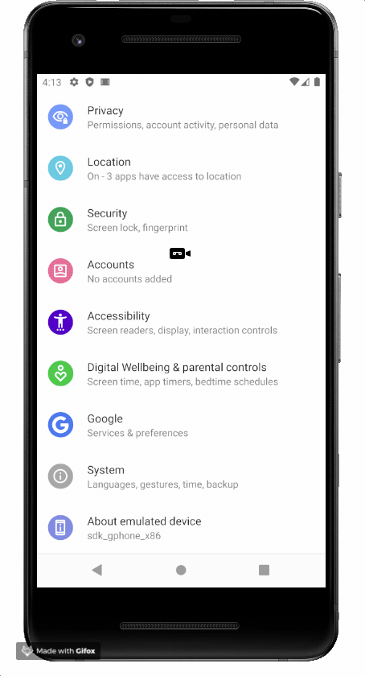
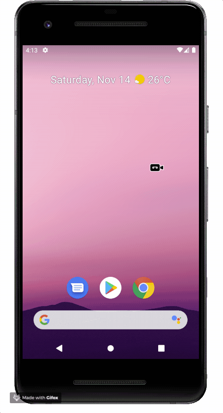
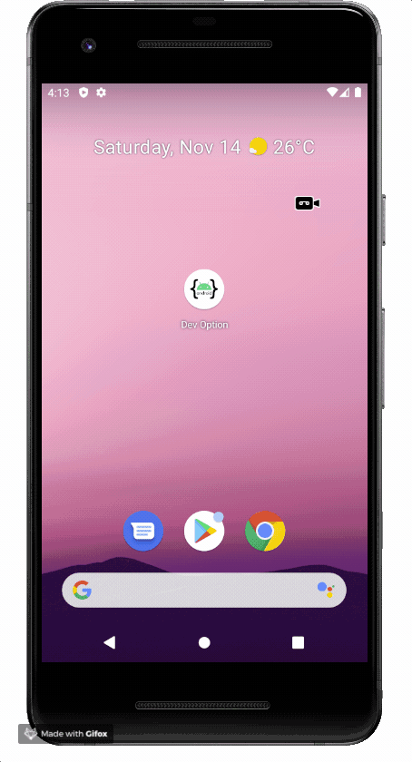
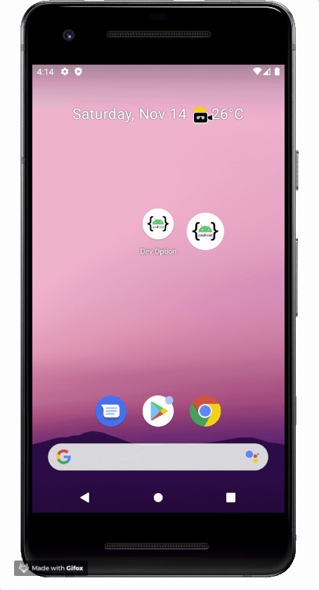
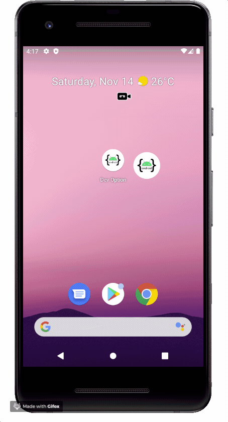

# Android Developer Options Shortcut

This app intends to be a helpful shortcut to the Android Developer Options screen.

It opens this screen by calling the intent: android.settings.APPLICATION_DEVELOPMENT_SETTINGS

## Usage

Make sure the Developer option is enabled. [Enable developer options](https://developer.android.com/studio/debug/dev-options)

### App Launch
Open the developer options directly by launching the app.

### Widget

Put a widget on the screen and launch the developer options by clicking it.

### Quick Settings Tile

For Android N and above it is possible put a tile on quick settings and lauch the developer option by clicking on it.

  

## Colaborate

Feel free to collaborate.

## License
[MIT](LICENSE.txt)